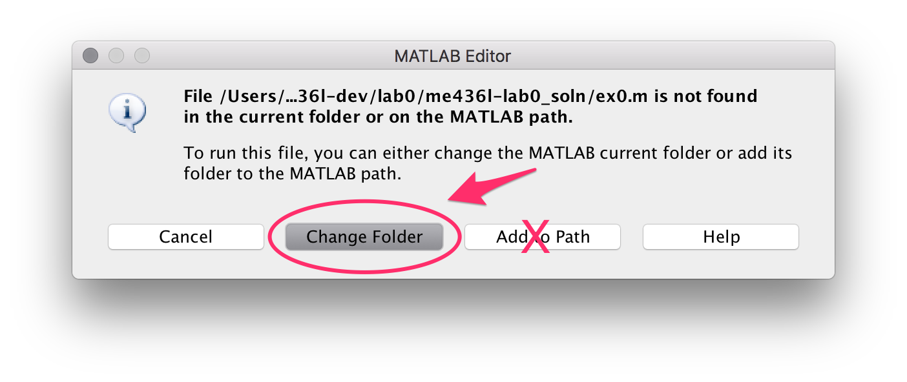

# Matlab Pre-lab/Homework Assignments

Repository housing the Matlab-based assignments and code for ME 436L.

### Motivation: Why Matlab?
From our experience, far too much time is lost slogging through the minutiae -- rather than focusing on the more critical aspects. With the assistance of `Matlab`, we can essentially sidestep many of these uninspiring, and often excessively mundane, tasks that detract from the core laboratory objectives. For instance -- since Excel is often the only software alternative -- locating cell numbers (and debugging), formatting charts, performing error-prone and repetitive calculations (property look-up's, interpolation, unit conversions \&, etc.), or attempting to process multiple datasets within a reasonable timeframe. Taken together, these tasks quickly snowball into a much larger (and time-consuming!) task than initially anticipated. More importantly, however, these mundane details dilute the overall message. We should be focused on performing experiments and exploring data - rather than fighting with software.

## Getting Started

While this is a public repo, it shouldn't be indexed by google.

- Note: [Matlab Drive](https://www.mathworks.com/products/matlab-drive.html) is an option. It can be used by all ISU students

	
## General To Do
1. run `check` on all MATLAB code and sync all `lib` functions
2. Clean up and sync all LaTeX files
3. Minimize amount of data included
4. Make sure everything runs on Windoze
5. Remove any references to 'common'
6. Comment all code
7. [TeX/Gen] Discuss ***submission template*** that will be provided each lab.

### Notes
- Might consider using `rmpath(folderName)`
- Lab techs need to clear off the `C:/temp/` folder and Desktop between lab sessions.
-  `addpath('./data')` may be bad practice. When students mess up the starting location, it can add that path to their working directory -- sometimes this is someone else's data...

## Lab Status

### Lab 0 ✅ [Complete] 
* **[Slides]** Make sure the slides match

### Lab 1 ⚠️ [Working]
* Requires some cleaning up yet.
* [TeX] - Some adjustments to code have been made, double check that TeX file matches

### Lab 2 🚫
* **Rewrite.** Instead of looping over all Excel sheets (was confusing) have them include the path or title of their data.
    * Currently there is only a 'Part 0' -- expand this to 1, 2, 3 (for each case/station)
* [TeX] - Some clarification is needed on how this script works.
* **Documentation** 
* Clean up figures and data.
    * Include data as `.txt` files

### Lab 3 🚫
* Code works well, needs more instructions and documentation
* [TeX] - Instructions require more details
* * **Documentation** 
* Clean up figures and data.
    * Include data as `.txt` files

### Lab 4 🚫
* **No Tex File/Instructions.**
* Code works well, needs simplified - badly.
* * * **Documentation** 
* Clean up figures and data.
    * Include data as `.txt` files

### Lab 5 🚫
*[Does Not Exist!]*

### Lab 6 🚫
* This script was not used in the summer session, a lot of work needs to be done.
* **No Tex File/Instructions.**
* `ex6_heat_flux.m` is done. Still need to:
    * `ex6_emissivity.m` has not been started.
    * `ex6_plot_emissivity.m` needs finished
    * Include excel formatting requirements in Tex file

## Notes/Warnings

### General:

- In the Heat Transfer Lab, MATLAB must be run from the local hard drive: `C:/temp/`, NOT on the server (*ie.,* **Desktop**, Group Folder, *&, etc.*). This will cause massive a chain of problems, notably:
    - 	The server is shared across all machines in the lab, and since there's a slight delay in the system, it's _very_ easy for groups to edit each other's code! They will work for a while and then suddenly the code will disappear.

- *Do not rename functions!*
- They cannot run functions -- they should only 'run' scripts
- Be careful with `Add to Path`:
        

-**Exporting Figures - NO SCREENSHOTS**

## Authors

* **Spencer Pfeifer** - *Initial work* - <spfeife@iastate.edu>

## Acknowledgments
[todo]
* Hat tip to anyone who's code was used
* Inspiration
* etc

